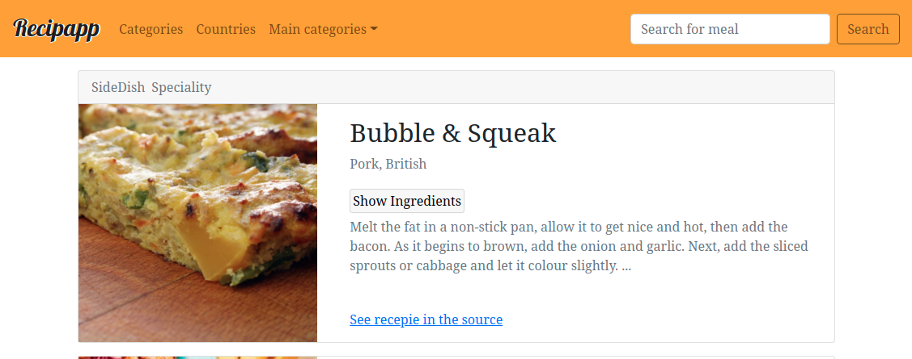

# Recipapp

App is deployed to Heroku: [https://agile-dusk-75413.herokuapp.com/](https://agile-dusk-75413.herokuapp.com/).

This project was bootstrapped with [Create React App](https://github.com/facebook/create-react-app).

### `npm start`

Runs the app in the development mode.\
Open [http://localhost:3000](http://localhost:3000) to view it in the browser.

The page will reload if you make edits.\
You will also see any lint errors in the console.

### Technology stack

App is build on [React](https://reactjs.org/) using React-hooks functional components only.
[Bootstrap v5.0](https://getbootstrap.com/) is used for styling purposes (bootstrap grid-layout and some components are used).

[Fraction.js](https://github.com/infusion/Fraction.js/) library is used to operate on fractions while counting ingredients amounts.

All HTTP-request are made using [AxiosJS](https://github.com/axios/axios);

### API used

[TheMealDB](https://www.themealdb.com/) is used to get recepies. Requests are made with developer test-only key '1'.